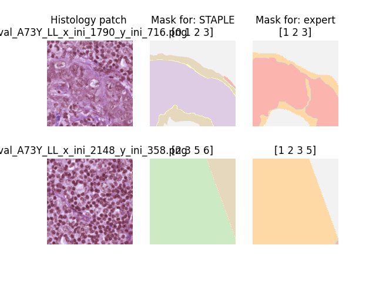

####################
 Experimental setup
####################

We established several experiments for training and benchmarking our
models, including the Oxford pet experiment and the histology images
experiment.

****************
 Oxford III Pet
****************

Our first experiment was elaborated on the Oxford-IIIT Pet Dataset. This
dataset contains 37 classes of pets, with around 200 images per class.
The dataset is divided into a training set and a test set. The training
set contains 3680 images, and the test set contains 3669 images. The
images are of different sizes and aspect ratios. The dataset is
available at the following link:
https://www.robots.ox.ac.uk/~vgg/data/pets/

In particular, we used an implementation of this dataset in a simplified
and easily retriable format, available at the following link:

https://github.com/UN-GCPDS/python-gcpds.image_segmentation

Scorers emulation
=================

On itself, the Oxford-IIIT Pet dataset contains the masks which reffer
to the ground truth and not to labels from different annotators, which
makes this dataset non suitable for the original intention of the
project. However, we used this dataset to emulate the scorers' behavior,
by training previously a model with a simple UNet architecture and then
using this model to predict for being disturbed in the last encoder
layer for producing scorers with different lebels of agreement.

.. image:: resources/oxford_pet_scorers_emulation.png
   :width: 100%
   :align: center
   :alt: How the scorers emulated noisy annotatiosn for the Oxford-IIIT Pet dataset look.

***********************************
 Crowd Seg Histopatological images
***********************************

Our second experiment was elaborated on the `CrowdSeg
<https://github.com/wizmik12/CRowd_Seg>`_ dataset, which consists of
Triple Negative Breast Cancer images labeled by 20 medical students.

This dataset fairly represents the original intention of the project,
which is to provide a tool for pathologists to segment histopathological
images.

The dataset is conformed by several histology patches of size 512x512
px. Masks labels exits for an expert pathologist and 20 medical
students. Every single patch contains label for some scorers as shown in
the figure:

Fetching and loading the dataset
================================

You can use the simple API provided by the ``seg_tgce.data.crowd_seg``
for either Fetching all available data or a single stage (train, test of
val).

You can fetch your data simply like this:

.. code:: python

   from seg_tgce.data.crowd_seg import get_all_data

   train, val, test = get_all_data(batch_size=8)
   for i in range(1):
      img, mask = val[i]
      print(f"Batch {i}: {img.shape}, {mask.shape}")

Output:

.. code:: text

   Batch 0: (8, 512, 512, 3), (8, 512, 512, 6, 23)

A single stage can also be fetched, and even visualized:

.. code:: python

   from seg_tgce.data.crowd_seg import get_stage_data
   from seg_tgce.data.crowd_seg.stage import Stage

   val = get_stage_data(stage = Stage.VAL, batch_size=8)
   val.visualize_sample()

For architecture debugging purposes, you can also fetch the data with a
downsampling for trimming scorers and leaving only the ones who scored
the most patches:

.. code:: python

   train = get_stage_data(stage = Stage.TRAIN, batch_size=8, trim_n_scorers=6)

Output:

.. code:: text

   Loading train data with trimmed scorers...
   INFO:seg_tgce.data.crowd_seg.generator:Limiting dataset to only images scored by the top 6 scorers: ['MV', 'STAPLE', 'expert', 'NP6', 'NP10', 'NP3']
   Train: 1272 batches, 10176 samples

When running the ``visualize_sample`` method, the generator will load
the images and masks from the disk and display them, with a result
similar to the following:

Loading the generator itself
============================

You can also instantiate the generator directly, from the class
``ImageDataGenerator``, which is the same as returned by the
``get_all_data`` and ``get_stage_data`` factories:

.. code:: python

   from seg_tgce.data.crowd_seg.generator import ImageDataGenerator
   from seg_tgce.data.crowd_seg.stage import Stage

   train_gen = ImageDataGenerator(
      stage=Stage.VAL,
      batch_size=16,
      n_classes=6,
    )
   print(f"Train len: {len(train_gen)}")
   print(f"Train masks scorers: {train_gen.n_scorers}")
   print(f"Train masks scorers tags: {train_gen.scorers_tags}")
   val_gen.visualize_sample(
     batch_index=8,
     sample_index=8,
     scorers=["NP8", "NP16", "NP21", "expert"],
   )

.. note::

   The ``ImageDataGenerator`` class is a subclass of the Keras
   ``Sequence`` class, which allows us to load the dataset in a lazy
   way. On the first instantiation, the generator will download the
   dataset in a local directory ``__data__/crowd_seg``, which might take
   a while. After that, the generator will load the images and masks on
   the fly, as requested by the training loop.
